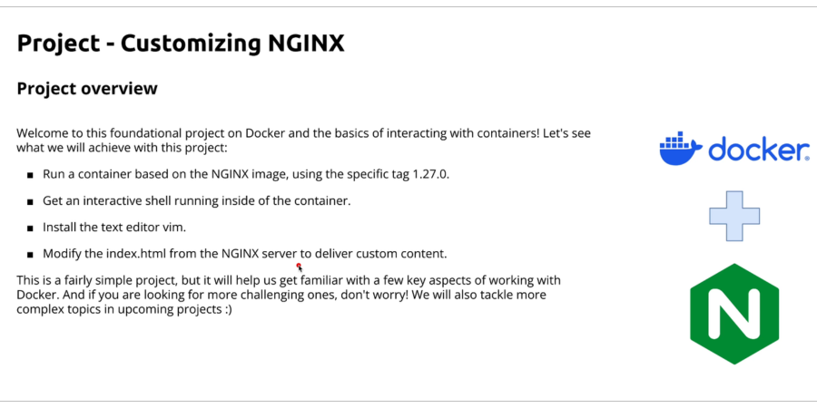

# Basic NGINX Setup
- **Project Overview**
    - The project focuses on customizing an **NGINX** server using Docker.
    - It serves as a foundational project, suitable for both beginners and those familiar with Docker.
- **Project Goals**
    - Run an **NGINX** container using the specific image tag 1.27.0.
    - Access the interactive shell inside the running container.
    - Install a text editor (**Vim** or **Vi**) inside the container.
    - Modify the `index.html` file to deliver custom content.
- **Learning Outcomes**
    - Helps in understanding key Docker concepts like container interaction and file modification.
    - Prepares users for more advanced projects in future lessons.
- **Encouragement for Practice**
    - Users can pause the video and try the steps on their own.
    - The goal is to ensure the **NGINX** server delivers the customized content.
  

This project focuses on customizing an NGINX server using Docker, making it ideal for both beginners and those already familiar with Docker. The goal is to run an NGINX container with the **1.27.0** image tag, access its interactive shell, install **Vim** or **Vi**, and modify the `index.html` file to serve custom content. This exercise reinforces key Docker concepts, such as container interaction and file modification, while setting the stage for more advanced projects. Users are encouraged to try these steps independently to ensure the server delivers customized content.
